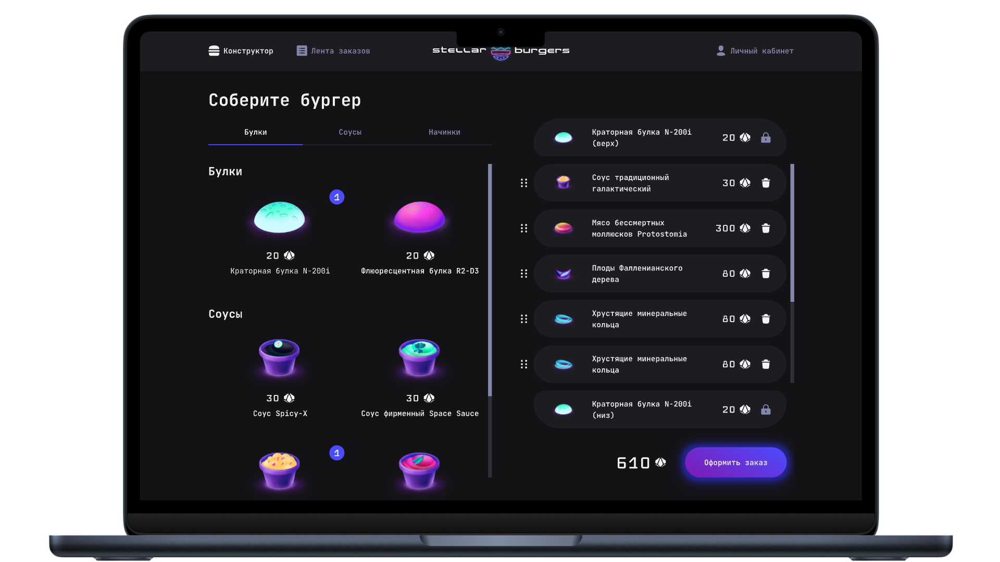

# Stellar Burgers

   

[Открыть Demo](https://m-n-pavlov.github.io/stellar-burgers/)



## Описание

Многофункциональное веб-приложение для заказа космических бургеров. 

**Функционал**

* Конструктор бургеров: сборка уникального заказа из ингредиентов, получаемых с сервера
* Лента заказов: обновление статусов заказов в реальном времени
* Личный кабинет: профиль пользователя с историей заказов и возможностью редактирования данных
* Система авторизации: регистрация, логин, восстановление пароля и защита приватных роутов
* Модальные окна: детальная информация об ингредиентах и заказах через URL-адреса
* UX: лоадеры для всех асинхронных запросов

## Стек технологий

* React: React Hooks, Context API
* Redux Toolkit: Slices, асинхронные Thunks
* TypeScript: полная типизация компонентов, экшенов и состояния
* React Router: динамические и защищенные маршруты
* REST API
* Webpack

## Запуск проекта

```bash
npm install
npm run start
```

## Настройка API

В проекте реализована гибкая конфигурация через переменные окружения. Для быстрого старта **дополнительная настройка не требуется** - по умолчанию используется актуальный эндпоинт Практикума.

Если вам необходимо переопределить адрес сервера, создайте в корне проекта файл `.env`:

```env
BURGER_API_URL=https://norma.education-services.ru/api
```

## Особенности
* **Загрузка данных:** при переходе в «Ленту заказов» возможна задержка загрузки данных, это связано с особенностями работы API Практикума (большой объем передаваемых данных)
* **Роутинг:** для корректной работы приложения на GitHub Pages используется `HashRouter`
